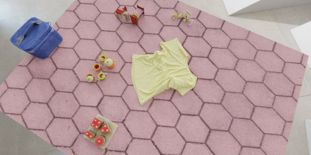

<h1 align="center">Learning Keypoints for Robotic Cloth Manipulation using Synthetic Data </h1>


<p align="center">
  <a href="https://tlpss.github.io/">Thomas Lips</a>,
  <a href="https://github.com/Victorlouisdg">Victor-Louis De Gusseme</a>,
  <a href="https://airo.ugent.be/members/francis/">Francis wyffels</a>
  <br/>
  <a href="https://airo.ugent.be/">AI and Robotics Lab (AIRO) </a>,
  <a href="https://www.ugent.be/">Ghent University</a>
  <br/>
  <a href="https://arxiv.org/abs/2401.01734">Arxiv paper </a>
<div align="center">
  
</div>
</p>


In this work we create a Blender-based pipeline for procedural data generation of clothes and use that data to learn perception models for robotic cloth manipulation.

This repo contains code to
- Generate procedural cloth meshes and to keep track of the vertices that correspond to each semantic keypoint
- deform cloth meshes using [Nvidia Flex](https://developer.nvidia.com/flex) or the blender cloth simulator, to generate the desired distribution of clothes (crumpled/almost flattened/..)
- build blender scenes and render images while storing keypoints and segmentation masks in COCO format.


We have generated data for *almost-flattened*  T-shirts, shorts and towels. The data generation pipeline can be easily extended to other cloth types, other deformation configurations (e.g. hanging from a robot gripper) and/or other data modalities (e.g. depth images...).

In the paper, we test the efficacy of the synthetic data by training keypoint detectors and evaulating their performance on the [aRTF Clothes dataset](https://github.com/tlpss/aRTF-Clothes-dataset).
The repo contains code to reproduce all experiments from the paper. A number of trained keypoint detectors are also made available. Informations on how to use these checkpoints can be found here [here](state-estimation/Readme.md).


Live interactions with these checkpoints can be seen here:
<iframe width="560" height="315" src="https://www.youtube.com/embed/Mlwg_qPxr78?si=VntdFciJBo_Cr3j-" title="YouTube video player" frameborder="0" allow="accelerometer; autoplay; clipboard-write; encrypted-media; gyroscope; picture-in-picture; web-share" referrerpolicy="strict-origin-when-cross-origin" allowfullscreen></iframe>

In addition we show how the keypoints can be used for folding T-shirts below.
In this video we take a single image using the ego-centric camera and predict keypoints on that image. Based on these keypoints, a scripted sequence of fold motions is executed that allow us to fold T-shirts.

<iframe width="560" height="315" src="https://www.youtube.com/embed/bqnQ4iLnp20?si=jCaGCxDZSOYlDuo1" title="YouTube video player" frameborder="0" allow="accelerometer; autoplay; clipboard-write; encrypted-media; gyroscope; picture-in-picture; web-share" referrerpolicy="strict-origin-when-cross-origin" allowfullscreen></iframe>

## High-level overview of the codebase

```
.
└── synthetic-cloth-data/
    ├── airo-blender/                          # Blender integration and utilities
    ├── pyflex/                                # source code and python bindings for Pyflex
    ├── state-estimation/
    │   └── state_estimation /
    │       └── keypoint_detection/            # train models and visualize results
    └── synthetic-cloth-data/
        └── synthetic_cloth_data/
            ├── materials/                     # procedural materials for clothes
            ├── meshes/
            │   ├── flat_meshes/               # generate flat meshes and post-process Cloth3d meshes
            │   └── deformations/              # deforming meshes using Blender or Pyflex
            ├── -synthetic_images/             # code to generate images using the cloth meshes, materials and other 3D artifacts.
            └── -visualize_meshes.py           # utility script to visualize cloth meshes
```

## Installation
Take the following steps to set up this repo locally:

- git clone submodules recurse: `git clone <repo> --recurse-submodules`
- create conda env: `conda env create -f environment.yaml`
- install & setup blender in airo-blender: from the `airo-blender/blender` folder, run `source ../bash_scripts/setup_blender.sh << path-to-your-conda-env`
- add blender to your path: from the `airo-blender/blender` folder, run `source add_blender_to_path.sh`
- download the blender assets that are used during the synthetic data generation, see [here](synthetic-cloth-data/synthetic_cloth_data/synthetic_images/assets/readme.md)
- (if you need it) install pyflex by following the instructions [here](pyflex/Readme.md)

## Generating Synthetic Data
The data generation pipeline has three steps:

1. obtain flat meshes
2. deform the meshes
3. render images and create the corresponding annotations


To manage the configurations, we use [Hydra](https://hydra.cc/). If you want to customize the data generation, make sure to familiarize yourself with this framework.
### Flat meshes
To obtain 'flat' meshes, we either have to rely on existing datasets such as [Cloth3d]() or procedurally create our own meshes.

We need meshes with a fine resolution (triangle edges of approx 1cm), good UV-mapping to apply materials and we also need to annotate the vertices that correspond to all semantic keypoints.

To generate the meshes procedurally, take a look at the [generate_flat_meshes.py](./synthetic-cloth-data/synthetic_cloth_data/meshes/flat_meshes/generate_flat_meshes.py) script.

To generate a few towel meshes, run
`blender -b -P meshes/generate_flat_meshes.py -- --cloth_type TOWEL --num_samples 4 --dataset_tag dev`

Make sure to add blender to your path first (see [here](#installation))

To visualize the meshes, run `blender -P visualize_meshes --dir flat_meshes/TOWEL/dev --show-keypoints`

### Deformed meshes
To generate deformed meshes with pyflex for the towels we created before, run `python meshes/pyflex_deformations/pyflex_deform_mesh.py`

You can visualize the meshes using `blender -P visualize_meshes --dir deformed_meshes/TOWEL/pyflex/dev --show-keypoints`
### Synthetic Images

Finally, we can render images and generate their annotations.

We need to build scenes in blender, add cloth meshes, distractors from the Google Scanned Objects datasets, HDR Lighting and cloth textures. TO generate the annotations, we need to determine which keypoints are visible and to reorder them to deal with symmetries.

To generate images using the meshes generated in the previous step, run  `python synthetic_images/generate_data.py`.


# Reproducing the Paper
This section contains all the commands to generate the datasets and train the keyppoints to reproduce all experiments and results described in the paper.
<details>
   <summary>Click here to expand</summary>

## Data Generation

### flat meshes
single-layer tshirts: `blender -b -P meshes/flat_meshes/generate_flat_meshes.py -- --cloth_type TSHIRT --num_samples 1000 --dataset_tag 00-final`

cloth3d tshirts: We manually cleaned 5 meshes from the [CLoth3D](https://hbertiche.github.io/CLOTH3D/) dataset and triangulated them. We then dropped them on a table to make them flat and resized them to generate additional diversity (see [this script](./synthetic-cloth-data/synthetic_cloth_data/meshes/flat_meshes/generate_scale_randomized_meshes.py)). Download them [here](https://cloud.ilabt.imec.be/index.php/s/x5yABaeFibq6eDL) and unzip to the `data/flat_meshes/TSHIRT` folder.

single-layer Towels: `blender -b -P meshes/flat_meshes/generate_flat_meshes.py -- --cloth_type TOWEL --num_samples 1000 --dataset_tag 00-final`

single-layer Shorts: `blender -b -P meshes/flat_meshes/generate_flat_meshes.py -- --cloth_type SHORTS --num_samples 1000 --dataset_tag 00-final`

### Deformed meshes
To deform the meshes created in the previous step, run the following commands:

single-layer Tshirts: `python meshes/deformations/pyflex_deformations/pyflex_deform_mesh.py +experiment=single-layer_tshirt `


single-layer Towels: `python meshes/deformations/pyflex_deformations/pyflex_deform_mesh.py +experiment=towel `

single-layer Shorts: `python meshes/deformations/pyflex_deformations/pyflex_deform_mesh.py +experiment=shorts `

### Synthetic Images
To finally generate the synthetic images using the deformed meshes, run following commands:

Tshirts-main: `python synthetic_cloth_data/generate_data.py --dataset-size 11111 --start_id 0  --hydra_config tshirts --hydra_args +experiment=tshirts-main`

Towels-main: `python synthetic_cloth_data/generate_data.py --dataset-size 11111 --start_id 0  --hydra_config towels --hydra_args +experiment=towels-main`

Shorts-main: `python synthetic_cloth_data/generate_data.py --dataset-size 11111 --start_id 0  --hydra_config shorts --hydra_args +experiment=shorts-main`


**Mesh comparisons**

*cloth3d meshes*

generate the deformed meshes: `python meshes/deformations/pyflex_deformations/pyflex_deform_mesh.py +experiment=cloth3d_tshirt`


generate the dataset: `python synthetic_images/generate_data.py --dataset-size 5000 --hydra_config=tshirts --hydra_args +experiment=tshirts-cloth3d-random-material`

*undeformed meshes*

generate the dataset: `python synthetic_images/generate_data.py --dataset-size 5000 --hydra_config=tshirts --hydra_args +experiment=tshirts-single-layer-flat-random-material`


**Material comparisons**

uniform materials: `python synthetic_images/generate_data.py --dataset-size 5000 --hydra_config=tshirts --hydra_args +experiment=tshirts-single-layer-hsv-material`

tailored materials: `python synthetic_images/generate_data.py --dataset-size 5000 --hydra_config=tshirts --hydra_args +experiment=tshirts-single-layer-full-material`


## Training the Keypoint Detectors
all code for training the keypoint detectors that are used in the paper is located in the `state-estimation/state_estimation/keypoint_detection` folder. You can find the instructions to reproduce the experiments [here](./state-estimation/Readme.md)


This [Keypoint Detection framework](https://github.com/tlpss/keypoint-detection) is used to train the models.


</details>
